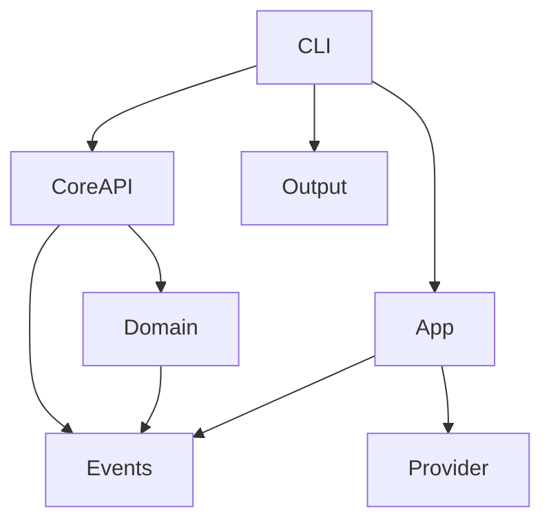

# HTask Architecture

This document describes the high-level architecture of `htask`.

## Overview

`htask` is a command-line task manager built using an **Event Sourcing** approach. The state of the task list is not stored directly; instead, an append-only log of events is maintained in a file (usually `.tasks`).

## Core Components

### 1. Events (`HTask.Events`)
This module defines the core event system.
- **Event Source/Sink**: Abstractions for reading and writing events.
- **File Backend**: Implementation that stores events as line-delimited JSON in a file.
- **Memory Backend**: Used for testing and in-memory operations.

### 2. Domain (`HTask.Core.Domain`)
Defines the fundamental types and logic for replaying events.
- **Task**: The primary data structure representing a task.
- **TaskStatus**: `Pending`, `InProgress`, `Complete`, `Abandoned`.
- **TaskIntent**: The payload of an event (e.g., `AddTask`, `StartTask`).
- **Replay Logic**: `foldEventLog` takes a sequence of events and reconstructs the `TaskMap`.

### 3. API (`HTask.Core.API`)
Provides high-level functions for task manipulation.
- **Commands**: `addTask`, `startTask`, `stopTask`, `completeTask`, `removeTask`.
- **Validation**: Enforces state transitions (e.g., you can't start a task that's already completed).
- **Match Logic**: Supports finding tasks by numeric index (1, 2, 3...) or by short UUID prefixes.

### 4. CLI (`HTask.CLI`)
Handles user interaction and output.
- **Options**: Uses `optparse-applicative` for command-line parsing.
- **Runners**: Maps CLI commands to Core API calls.
- **Output**: Handles pretty-printing and JSON output, including ANSI colors and status symbols.

### 5. Providers (`HTask.Provider`)
Used for dependency injection of side-effecting operations like getting the current time or generating random UUIDs. This keeps the core logic pure and testable.

## Data Flow

1. **Input**: User runs a command (e.g., `htask start 1`).
2. **Parsing**: `HTask.CLI.Options` parses the command and flags.
3. **Execution**: `HTask.CLI.Runners` invokes the relevant `HTask.Core.API` function.
4. **Replay**: The Core API reads the event log from disk and replays it to get the current state.
5. **Validation**: The command is checked against the current state.
6. **Persistence**: If valid, a new event is created and appended to the event log file.
7. **Output**: The result (success or error) is rendered to the terminal.

## Dependency Diagram

