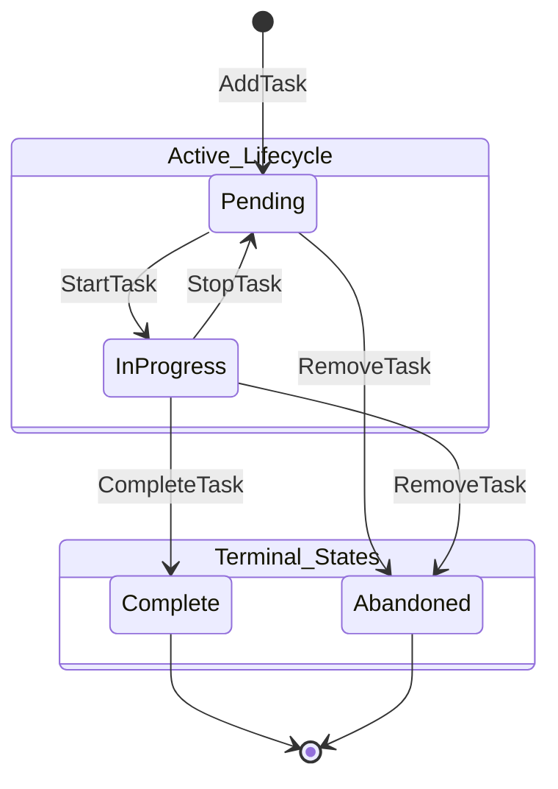

# Task State Machine

This document defines the allowed states and transitions for tasks in `htask`.

## States

- **Pending**: The initial state of a task. It is waiting to be worked on.
- **InProgress**: The task is currently being active. Only one task should typically be in this state at a time (though not strictly enforced by the core logic).
- **Complete**: The task has been successfully finished. This is a terminal state.
- **Abandoned**: The task has been removed or cancelled without being finished. This is a terminal state.

## Transitions

The following diagram illustrates the valid transitions between states:

## Validation Rules

The `htask-core` API enforces the following rules:

1. **Start**: A task can only be started if it is currently `Pending`.
2. **Stop**: A task can only be stopped if it is currently `InProgress`.
3. **Complete**: A task can only be completed if it is currently `InProgress`.
4. **Remove**: A task can be abandoned from `Pending` or `InProgress`. It cannot be removed if it is already `Complete`.
5. **Terminality**: Once a task reaches `Complete` or `Abandoned`, it cannot transition to any other state.
